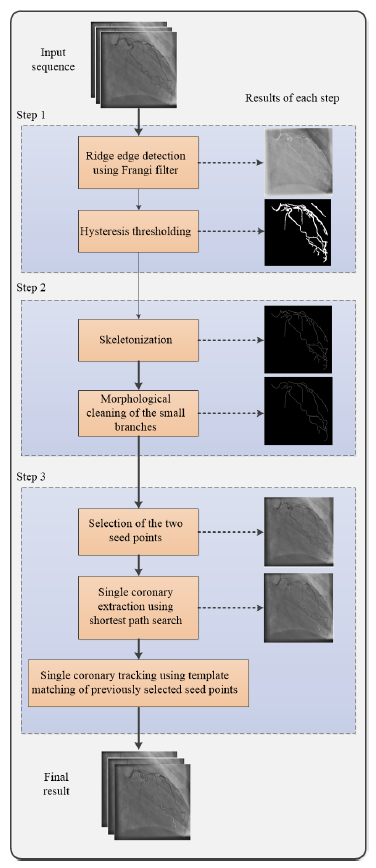
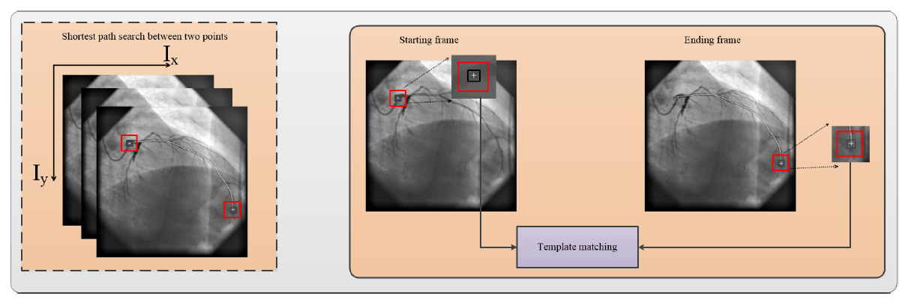

## Centerline Tracking of the Single Coronary Artery from X-ray Angiograms

Accurate determination of physiology and morphology of individual coronary artery is a prerequisite for its quantification as well as for planning procedures such as angioplasty. 

This semi-automatic method for centerline extraction and tracking of the single coronary artery is based on ridge edge detection and thresholding, after which the centerline of a vessel tree is extracted using skeletonization. 

The whole image processing workflow is shown in Figure below:

 

After that, we manually select two points: (1) at the start and (2) at the end of the single coronary artery. The shortest path between selected points is found and single coronary centerline is extracted. After that the template matching is used fort tracking single centerline the whole X-ray sequence. 

Tracking workflow is shown below: 

### 
To start, use following line:

     python3 gui_track.py

### Citation: 

If this project is interesting to you, consider citing:

    @INPROCEEDINGS{9219025,  
    author={Habijan, Marija and Babin, Danilo and Galíc, Irena and Leventić, Hrvoje and Velicki, Lazar and Čanković, Milenko},  
    booktitle={2020 International Symposium ELMAR},   title={Centerline Tracking of the Single Coronary Artery from X-ray Angiograms},   
    year={2020},  
    volume={},  
    number={},  
    pages={117-121},  
    doi={10.1109/ELMAR49956.2020.9219025}}

